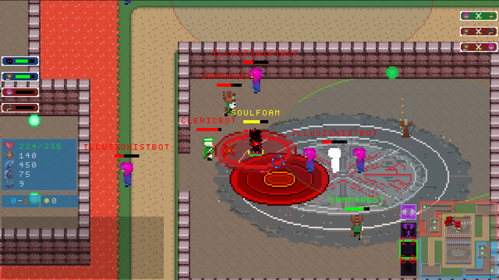
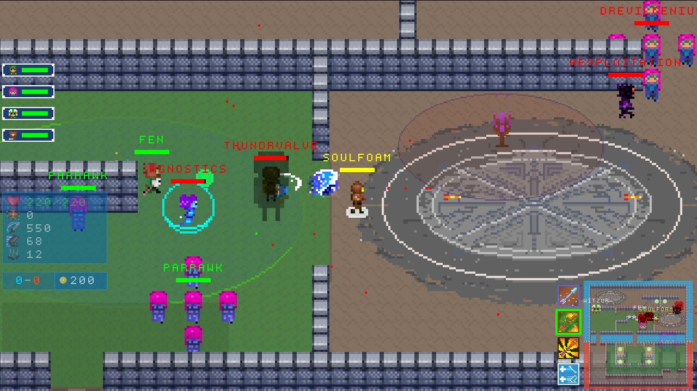
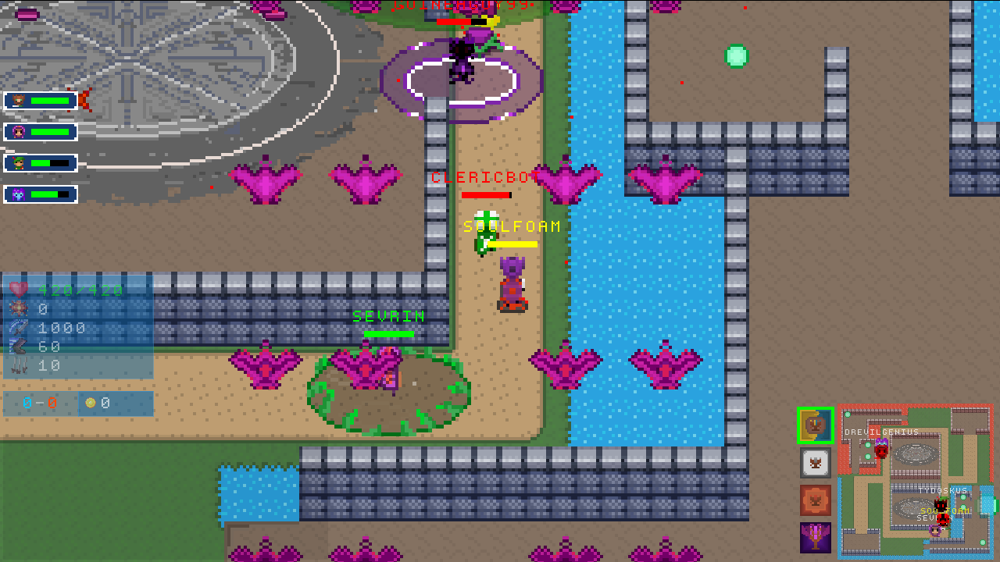
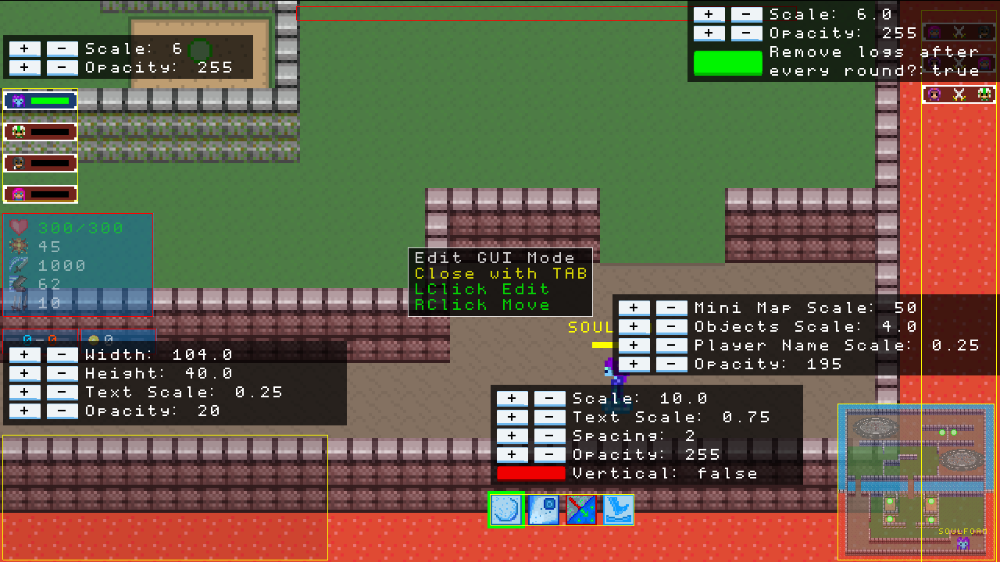
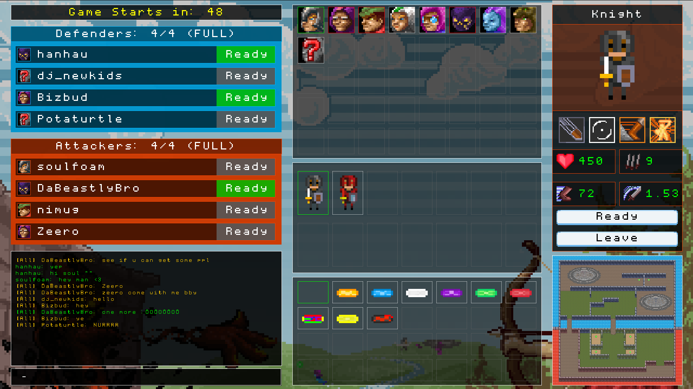
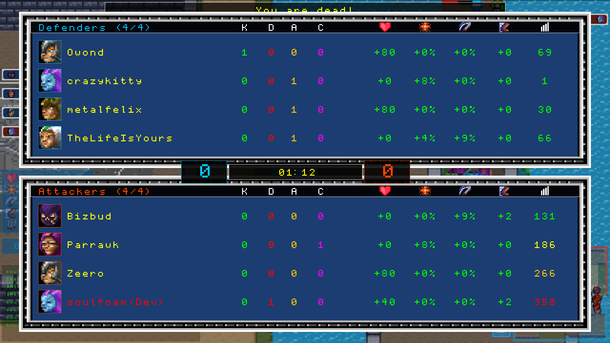
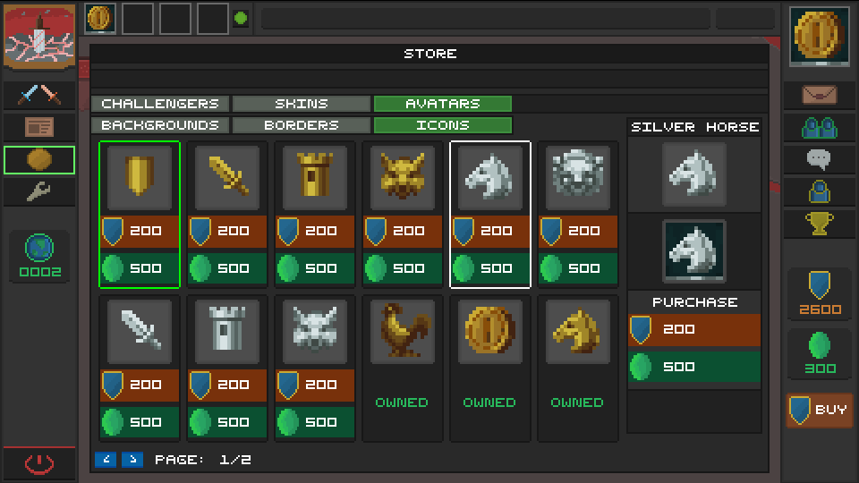
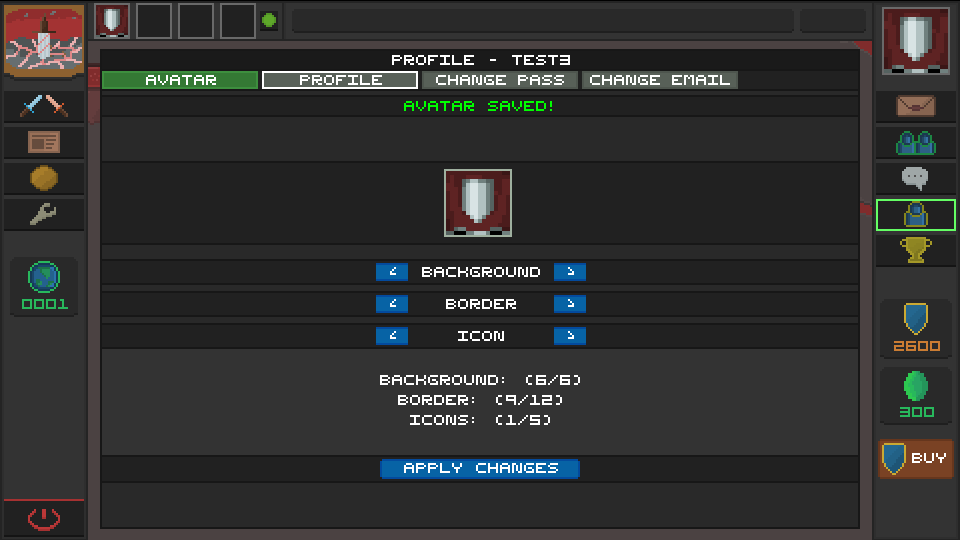
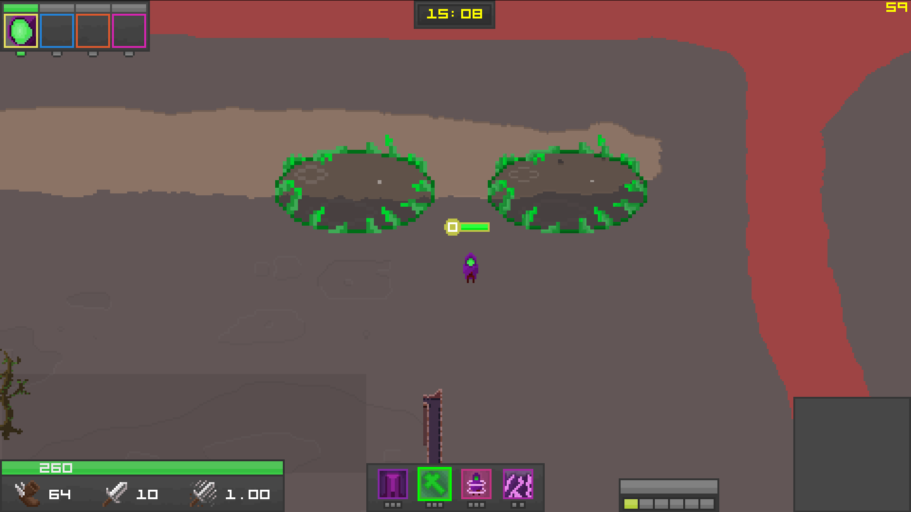
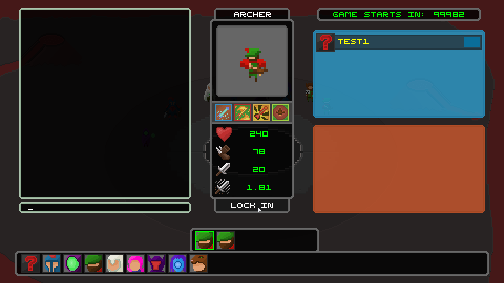

## NOTICE, DO NOT VISIT BITSIEGE.COM
Unfortunately I let the domain expire some years ago by not updating my card on file and the domain was renewed by what appears to be a pornography spam site. Sorry :(

# About

This is all legacy code from the original 2014 game. Everything worked pretty well, but this is not the best code I've ever written. The core logic is almost duplicated between client and server, and not in one central place and shared as it should be. 

Also, since beta had guest accounts to test all systems, the account registering/logging in is not secure and would need to be updated before a launch. Mostly just the fact the client sends its password over the network to login. One method would be to never send the password over the network at all, and have the server randomly generate a salt and send it to the client. The server would encrypt and store the salt using the users password hash as a key. Once the client gets the unencrypted salt from the server, it would hash the inputted plaintext password then encrypt the salt with the generated hash, and if the clients encrypted salt equals the servers, it's a successful login.

The rendering uses Slick2D which is a wrapper over OpenGL, which I wouldn't do nowadays, I'd just use straight up OpenGL so I could fully utilize shaders and other stuff. 

Since the project started in 2014, I've learned so much more about gamedev in general, but this project will always have a special place in my heart and maybe one day it will be fully revived.

These screen shots are of newer gameplay (around late 2016 early 2017), but you can [watch an old gameplay trailer](https://www.youtube.com/watch?v=Rh9tfoPhSN0) from 2016 too.

# Screenshots

# Menu

# New Art Concepts

